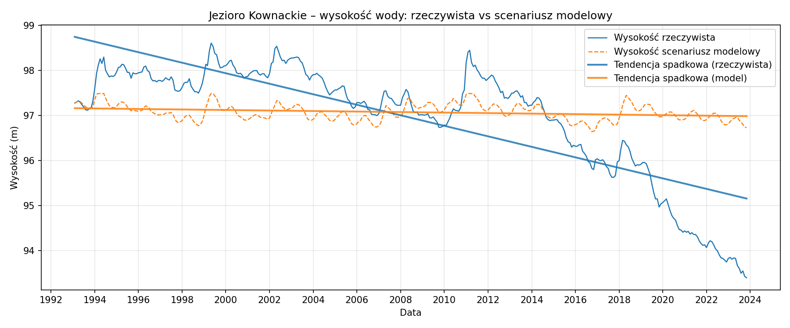
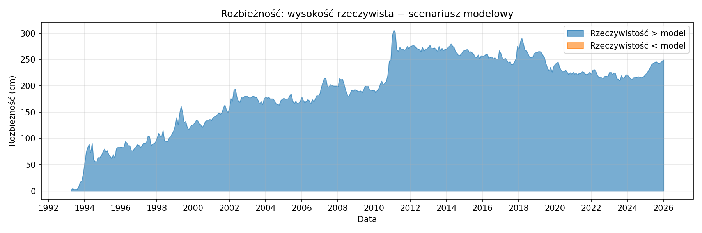
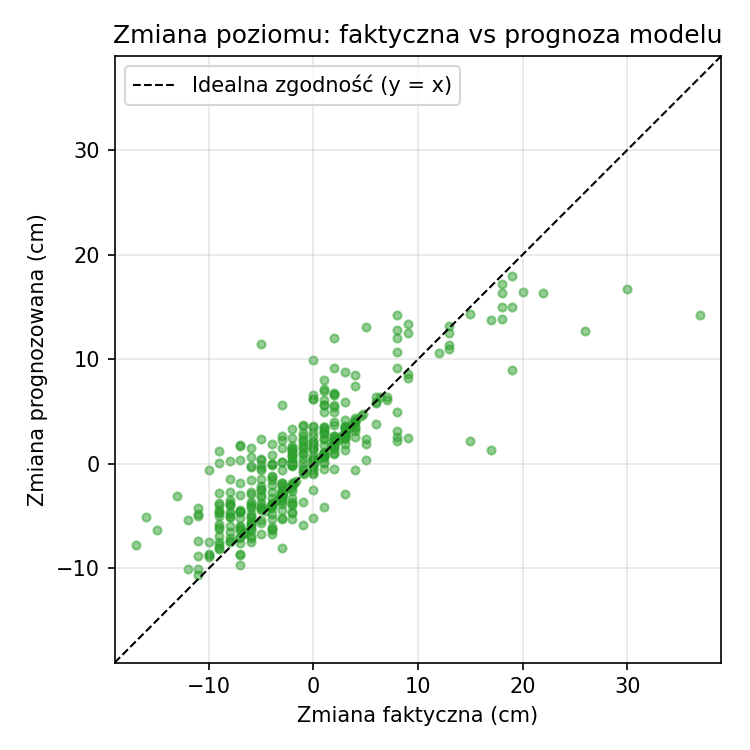
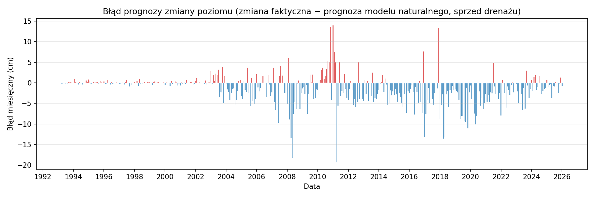

# Raport podsumowujący: prognoza zmiany poziomu Jezioro Kownackie

## 1. Cel projektu

Projekt ma na celu:
- zbudowanie **modelu uczenia maszynowego**, który na podstawie opadu i temperatury (oraz sezonowości i historii) prognozuje **miesięczną zmianę poziomu** Jezioro Kownackie;
- **ewaluację** prognoz względem rzeczywistych pomiarów.

---

## 2. Dane

- **Źródło:** plik `data/kownackie/data.csv`.
- **Zakres:** dane miesięczne (pierwszy dzień miesiąca).
- **Kolumny:** Data, Poziom (m), Zmiana (m), Opad (mm), Temperatura (°C).
- **Target:** Zmiana – miesięczna zmiana poziomu.
- Wiersze z błędami (#ERROR!) lub brakami są pomijane. Po usunięciu lagów (5 mies.) do analizy wchodzi **394** miesięcy.

---

## 3. Model

| Element | Opis |
|--------|------|
| Algorytm | Gradient Boosting (regresja), scikit-learn |
| Cechy wejściowe | Miesiąc (sin/cos), Opad, Temperatura, opad i temperatura z opóźnieniem 1–5 mies., 3 opóźnienia zmiany poziomu, 3 opóźnienia poziomu |
| Trening | Podział czasowy: trening do 2023-12, test od 2024 do 2023 |
| Wynik | Prognoza zmiany poziomu na dany miesiąc (cm) |

Model **nie** używa bieżącego poziomu – tylko opad, temperatura, sezon i historia.

---

## 4. Wyniki ewaluacji

- **MAE (średni błąd bezwzględny):** nan cm
- **RMSE:** nan cm
- **Liczba miesięcy:** 394

### 4.1. Wysokość wody: rzeczywista vs scenariusz modelowy

Scenariusz modelowy: start od poziomu na początek pierwszego miesiąca; w każdym miesiącu dodawana jest **prognozowana** zmiana (kumulatywnie).

### 4.2. Rozbieżność w czasie

Rozbieżność = wysokość rzeczywista − wysokość w scenariuszu modelowym. Wartość dodatnia: jezioro wyżej niż przewidywał model; ujemna: niżej.

### 4.3. Zmiana poziomu: faktyczna vs prognoza

Punkty przy linii y = x oznaczają dobrą zgodność miesięcznych zmian.

### 4.4. Błąd miesięczny

Błąd = zmiana faktyczna − zmiana prognozowana w każdym miesiącu.

---

## 5. Podsumowanie

- Model prognozuje miesięczną zmianę poziomu Jezioro Kownackie z MAE ~nan cm.
- Scenariusz kumulatywny (wysokość z prognozowanej zmiany) jest porównywany z rzeczywistą wysokością; rozbieżność i błąd miesięczny opisują jakość prognoz.

Szczegóły techniczne: [model.md](../model.md), [podsumowanie_ewaluacji.md](podsumowanie_ewaluacji.md).

*Wygenerowano: 2026-02-15 15:54*
