# Podsumowanie zbiorcze – prognoza poziomu jezior i odbudowa

---

## 1. Najważniejsze wnioski

- Modele uczenia maszynowego (Gradient Boosting, scikit-learn) prognozują **miesięczną zmianę poziomu** jezior na podstawie opadu, temperatury, sezonowości (miesiąc) oraz opóźnień zmiany i poziomu; nie używają bieżącego poziomu. Dla każdego jeziora osobny model i ewentualnie opóźnienia meteo (Fibonacciego).

- **Jakość prognoz na zbiorze testowym** jest zróżnicowana: MAE od ok. 1,5 cm (Budzisławskie) do ok. 7,3 cm (Suszewskie). RMSE od ok. 1,9 cm do ok. 9,7 cm. Najsłabsze metryki ma Suszewskie, najlepsze Budzisławskie i Powidzkie.

- **Rozbieżność** (wysokość rzeczywista minus wysokość w scenariuszu modelowym) jest w większości jezior **ujemna w ostatnich latach** – poziom rzeczywisty poniżej scenariusza opartego wyłącznie na klimacie i sezonowości. Interpretacja: prawdopodobny **dodatkowy czynnik drenujący** (np. oddziaływanie leja depresji, melioracje, zmiana odpływu podziemnego).

- **Szacunek odbudowy** po zaniku dodatkowego drenażu ma charakter teoretyczny: przy założonym tempie zamykania luki (scenariusz symmetric lub stałe 5 cm/rok) czas do zrównania z modelem waha się od kilku do ponad 100 lat w zależności od jeziora. Projekcja z **wzniosem wód gruntowych** startuje od lutego 2026; do tego momentu poziom rzeczywisty ekstrapolowany jest trendem z ostatnich 5 lat pomiarów; wykres kończy się w momencie zrównania z modelem (koniec odbudowy).

- **Podział danych**: Jeziora z oddziaływaniem leja depresji (Budzisławskie, Koziegłowskie, Ostrowskie, Suszewskie, Wilczyńskie) – trening do lutego 2003, test od marca 2003 do 2023. Niedzięgiel i Powidzkie – trening do 2013, test 2014–2023. Skulska Wieś – trening do 2015, test 2016–2023.

---

## 2. Wnioski per jezioro

**Jezioro Budzisławskie**  
Okres testowy 1993-02 – 2023-11, 370 miesięcy. MAE 0,0156 m, RMSE 0,0193 m. Średnia rozbieżność (ostatnie 12 miesięcy) ok. -1,87 m; trend rozbieżności ok. -6,6 cm/rok. Szacunek odbudowy (symmetric) ok. 28 lat, przy 5 cm/rok ok. 37 lat. Silny trwały dryf ujemny.

**Jezioro Koziegłowskie**  
Okres testowy 1996-02 – 2023-11, 334 miesiące. MAE 0,0274 m, RMSE 0,0357 m. Średnia rozbieżność ok. -0,94 m; trend ok. -4,4 cm/rok. Szacunek odbudowy (symmetric) ok. 21 lat, przy 5 cm/rok ok. 19 lat.

**Jezioro Niedzięgiel**  
Okres testowy 1976-06 – 2023-11, 570 miesięcy. MAE 0,0183 m, RMSE 0,0227 m. Średnia rozbieżność ok. -0,73 m; trend ok. -0,84 cm/rok. Szacunek odbudowy (symmetric) ok. 87 lat, przy 5 cm/rok ok. 15 lat. W ostatnich 5 latach poziom rzeczywisty opadał (trend ujemny) – uwzględniony w projekcji do II 2026.

**Jezioro Ostrowskie**  
Okres testowy 1993-02 – 2023-11, 370 miesięcy. MAE 0,0262 m, RMSE 0,038 m. Średnia rozbieżność ok. -3,33 m; trend ok. -10,7 cm/rok. Szacunek odbudowy (symmetric) ok. 31 lat, przy 5 cm/rok ok. 67 lat. Jedno z najbardziej dotkniętych ujemną luką.

**Jezioro Powidzkie**  
Okres testowy 1976-06 – 2023-11, 570 miesięcy. MAE 0,0176 m, RMSE 0,0223 m. Średnia rozbieżność ok. -0,38 m; trend ok. -0,67 cm/rok. Szacunek odbudowy (symmetric) ok. 56 lat, przy 5 cm/rok ok. 7,5 lat. Stosunkowo najmniejsza luka w grupie.

**Jezioro Skulska Wieś**  
Okres testowy 1993-02 – 2023-11, 370 miesięcy. MAE 0,0224 m, RMSE 0,028 m. Średnia rozbieżność dodatnia (ok. +0,09 m); trend rozbieżności dodatni. Brak szacunku odbudowy w sensie zamykania luki ujemnej – rozbieżność nie utrzymuje się silnie ujemna.

**Jezioro Suszewskie**  
Okres testowy 1994-04 – 2023-11, 356 miesięcy. MAE 0,0734 m, RMSE 0,0974 m – najwyższe błędy w zestawie. Średnia rozbieżność ok. -4,39 m; trend ok. -15,6 cm/rok. Szacunek odbudowy (symmetric) ok. 28 lat, przy 5 cm/rok ok. 88 lat. Bardzo duża luka i silny dryf.

**Jezioro Wilczyńskie**  
Okres testowy 1993-02 – 2023-11, 370 miesięcy. MAE 0,0359 m, RMSE 0,0461 m. Średnia rozbieżność ok. -5,17 m; trend ok. -19,3 cm/rok. Szacunek odbudowy (symmetric) ok. 27 lat, przy 5 cm/rok ok. 103 lata. Największa luka i jeden z najsilniejszych trendów ujemnych.

---

## 3. Wspólne trendy regionalne

- **Grupa z lejem depresji** (Budzisławskie, Koziegłowskie, Ostrowskie, Suszewskie, Wilczyńskie): wspólna cecha – trening zakończony w II 2003 z powodu anomalii w danych; w okresie testowym systematyczna ujemna rozbieżność i narastający dryf. Sugeruje to wspólny czynnik (np. odwodnienia, oddziaływanie kopalni) działający od ok. 2003.

- **Niedzięgiel i Powidzkie**: dłuższe szeregi (od lat 70.), trening do 2013; również ujemna rozbieżność w ostatnich latach, ale dynamika i wielkość luki inne niż w grupie „lej depresji”. Możliwa opóźniona lub lokalnie zróżnicowana reakcja.

- **Skulska Wieś**: jedyne jezioro z rozbieżnością średnio dodatnią i trendem dodatnim w ostatnim okresie – nie wykazuje typowego sygnału „drenażu” w tym samym kierunku co pozostałe.

- W pliku zanik_drenazu podane są wzniosy wód gruntowych (bez zalania) w cm/rok: wyższe (21) dla Koziegłowskiego, Budzisławskiego, Suszewskiego, Wilczyńskiego; średnie (13) dla Ostrowskiego, Powidzkiego, Skulskiej Wsi; niższe (8) dla Niedzięgła. Używane w projekcji odbudowy od II 2026.

---

## 4. Ograniczenia danych i niepewności

- Szacunek odbudowy jest **teoretyczny**; nie ma pełnego modelu hydrologicznego odbudowy. Rzeczywisty czas zależy od zatrzymania drenażu, warunków klimatycznych i bilansu wód podziemnych.

- Dane wejściowe: miesięczne (Data, Poziom, Zmiana, Opad, Temperatura); wiersze z błędami lub brakami pomijane. Jeden zestaw meteo (opad, temperatura) może być współdzielony między jeziora – nie weryfikowano w dokumentach spójności źródeł meteo per jezioro.

- Scenariusz modelowy: limit wysokości (max spiętrzenia) i strefa odpływu obliczane z danych; przesączanie w strefie – uproszczenie. Model nie uwzględnia explicite wód gruntowych ani drenażu zewnętrznego.

- Różna długość szeregów i różne okresy testowe utrudniają bezpośrednie porównanie „kiedy zaczął się rozjazd” między jeziorami bez wspólnej analizy change-point.

---

## 5. Wykresy

Poniżej zestawienie wszystkich wykresów: dla każdego jeziora cztery wykresy ewaluacji (wysokość rzeczywista vs model, rozbieżność w czasie, zmiana faktyczna vs prognoza, błąd miesięczny) oraz wykres projekcji odbudowy. Pliki w katalogach docs/figures_{jezioro} oraz docs/figures_odbudowa.

### Jezioro Budzisławskie

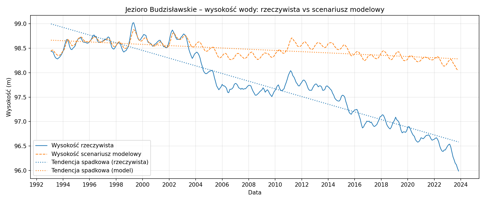

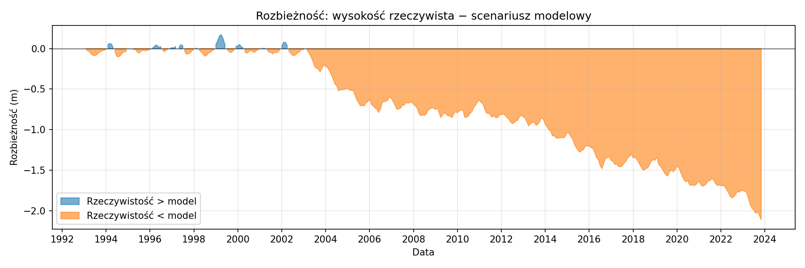

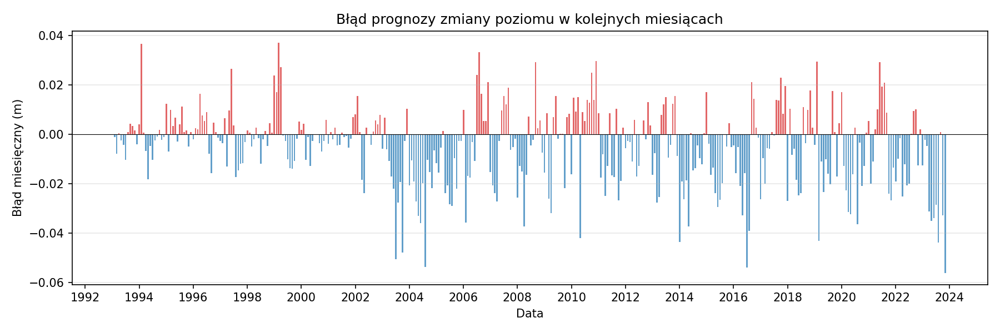

### Jezioro Koziegłowskie

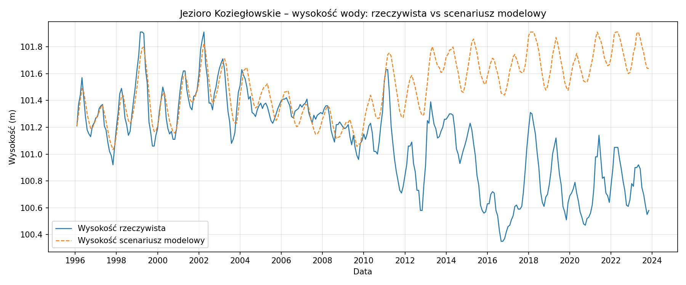

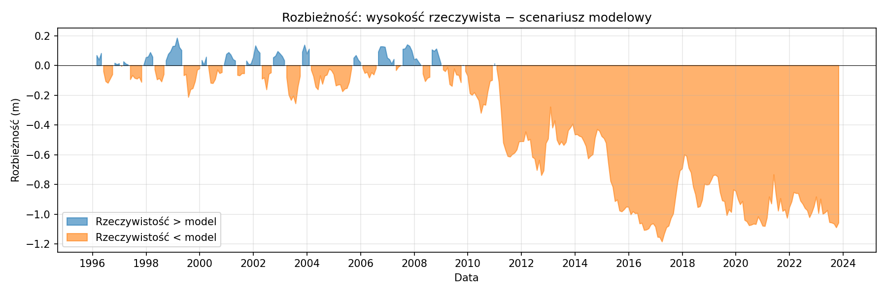

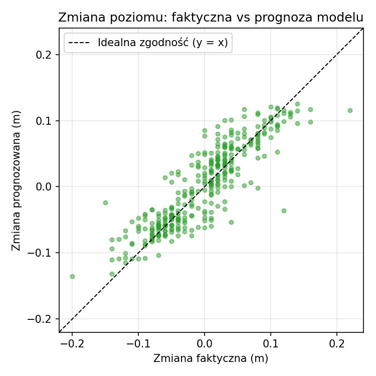

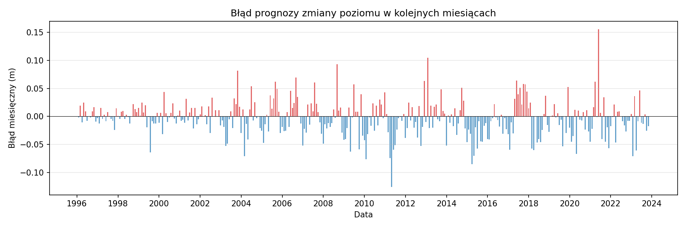

### Jezioro Niedzięgiel

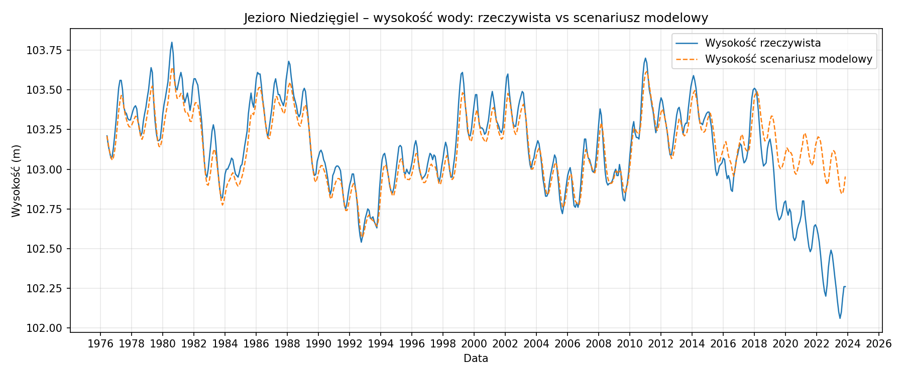

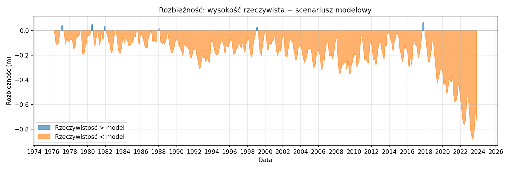

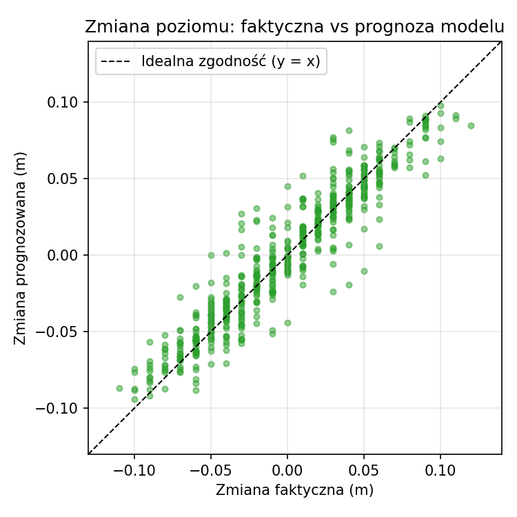

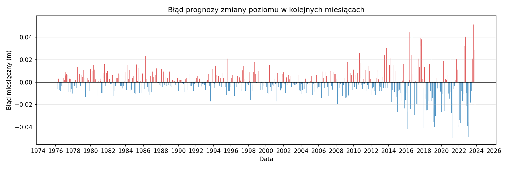

### Jezioro Ostrowskie

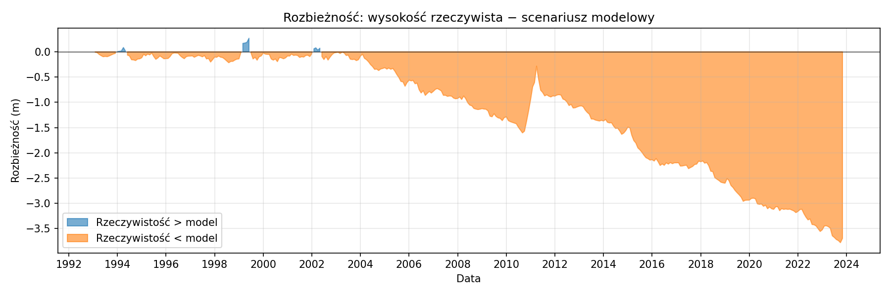

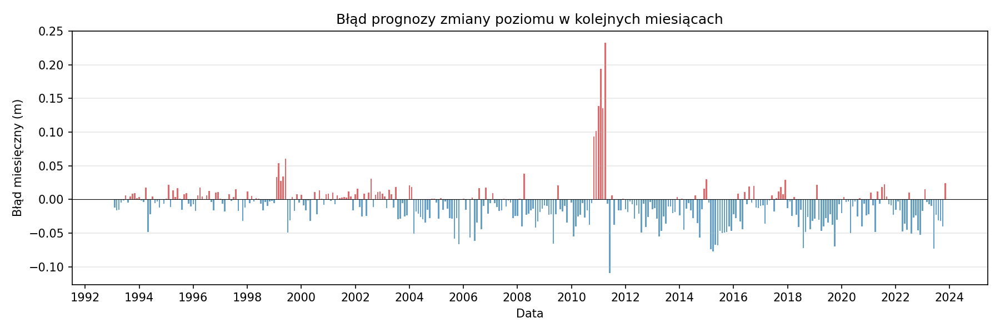

### Jezioro Powidzkie

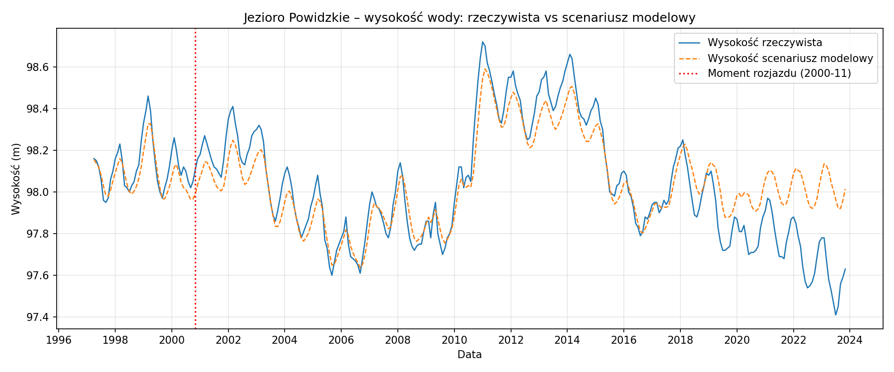

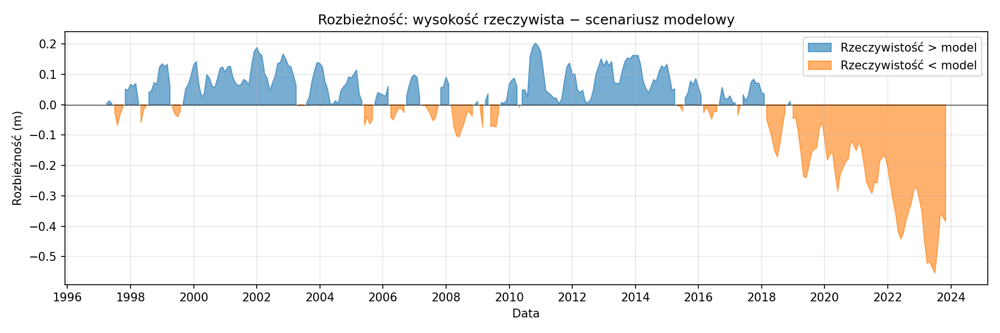

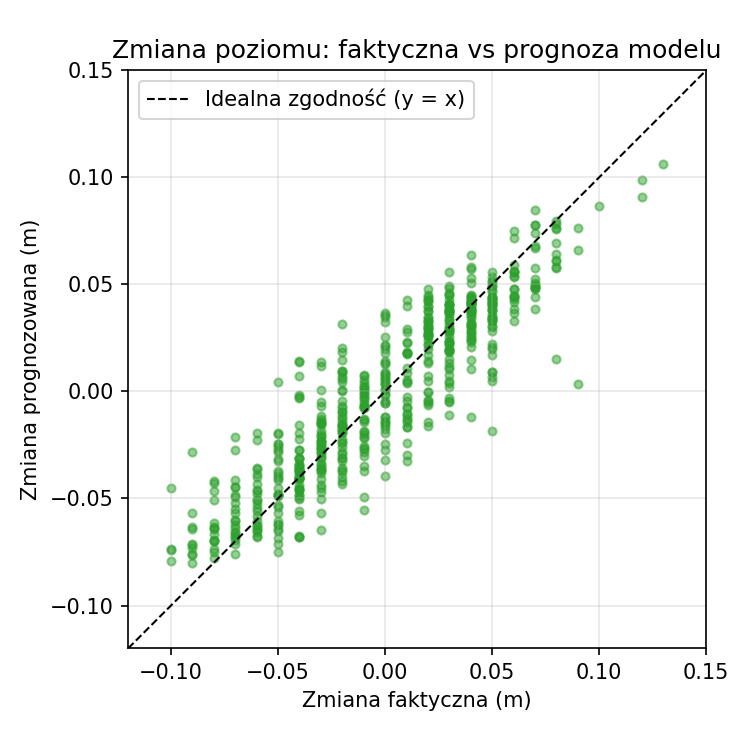

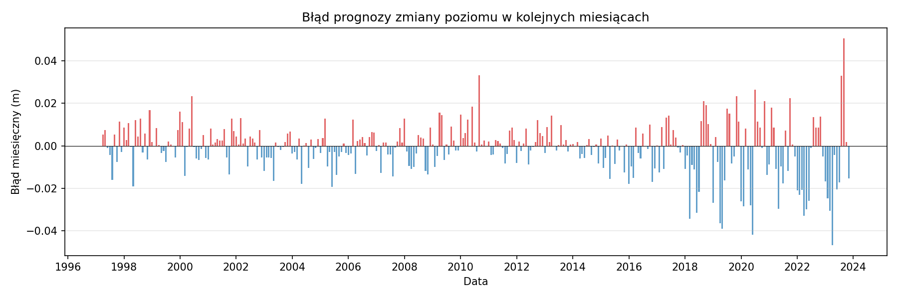

### Jezioro Skulska Wieś

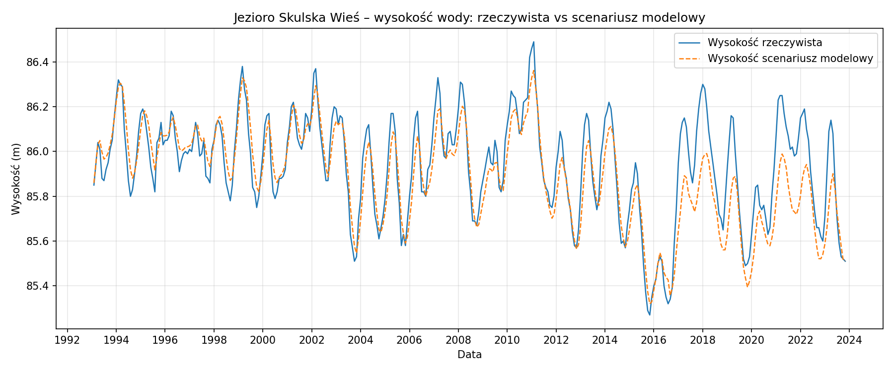

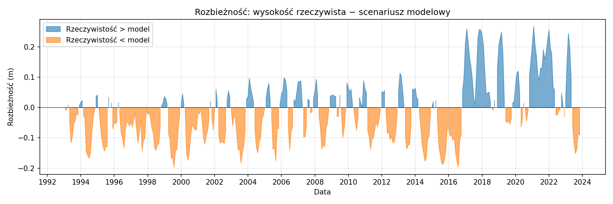

### Jezioro Suszewskie

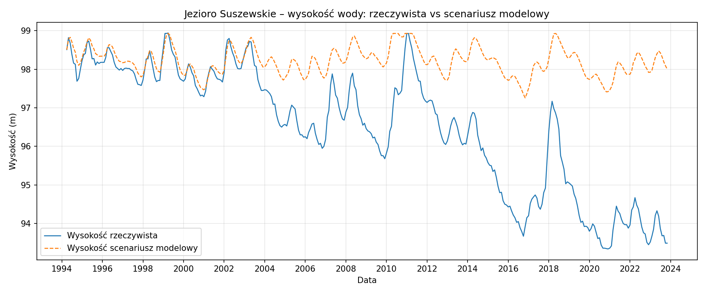

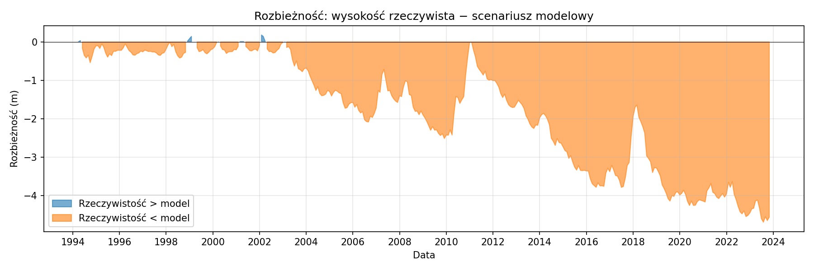

### Jezioro Wilczyńskie

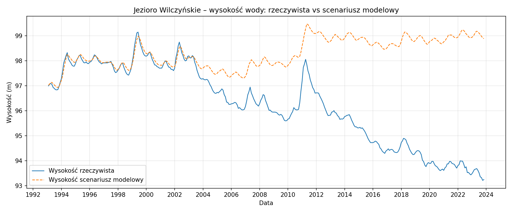

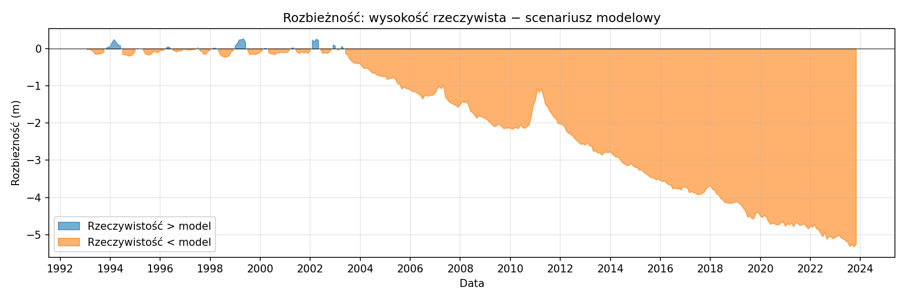

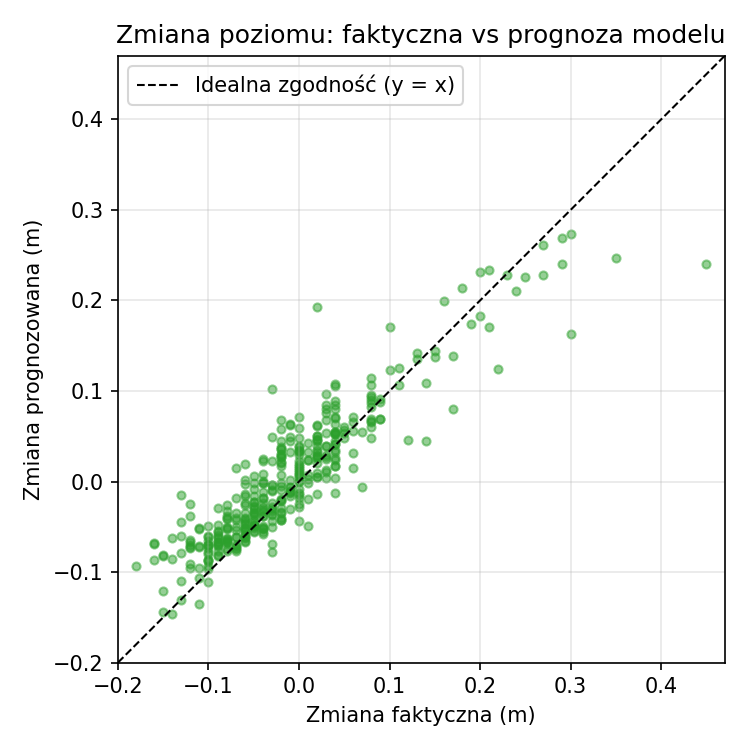

---

