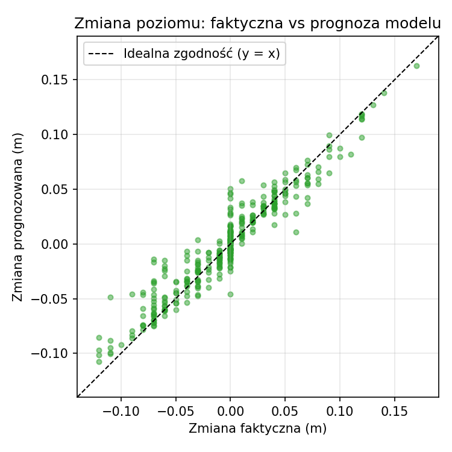
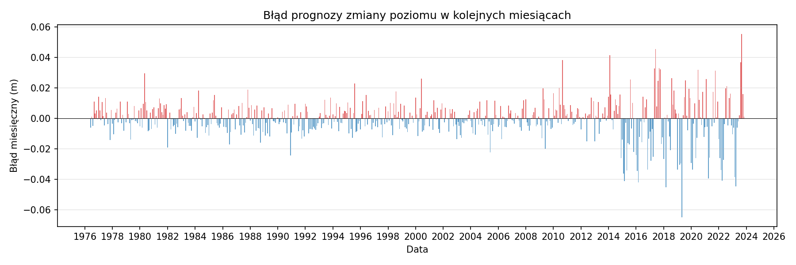

# Raport podsumowujący: prognoza zmiany poziomu Jeziora Niedzięgiel

## 1. Cel projektu

Projekt ma na celu:
- zbudowanie **modelu uczenia maszynowego**, który na podstawie opadu i temperatury (oraz sezonowości i historii) prognozuje **miesięczną zmianę poziomu** Jeziora Niedzięgiel;
- **ewaluację** prognoz względem rzeczywistych pomiarów;
- **wykrycie momentu**, od którego Jezioro Niedzięgiel przestało reagować zgodnie z modelem (poziom rzeczywisty trwale odbiega od scenariusza opartego na prognozach).

Teza: do pewnego momentu zachowanie poziomu Jeziora Niedzięgiel da się wyjaśnić opadem i temperaturą; od pewnego momentu ta zależność została przerwana (np. zmiana odpływu, regulacja, użytkowanie).

---

## 2. Dane

- **Źródło:** plik `data/data.csv`.
- **Zakres:** dane miesięczne (pierwszy dzień miesiąca), od 1997 r.
- **Kolumny:** Data, Poziom (m), Zmiana (m), Opad (mm), Temperatura (°C).
- **Target:** Zmiana – miesięczna zmiana poziomu.
- Wiersze z błędami (#ERROR!) lub brakami są pomijane. Po usunięciu lagów (3 miesiące) do analizy wchodzi **343** miesięcy.

---

## 3. Model

| Element | Opis |
|--------|------|
| Algorytm | Gradient Boosting (regresja), scikit-learn |
| Cechy wejściowe | Miesiąc (sin/cos), Opad, Temperatura, 3 opóźnienia zmiany poziomu, 3 opóźnienia poziomu |
| Trening | Podział czasowy: ostatnie 70 miesięcy = zbiór testowy |
| Wynik | Prognoza zmiany poziomu na dany miesiąc (m) |

Model **nie** używa bieżącego poziomu – tylko opad, temperatura, sezon i historia.

---

## 4. Wyniki ewaluacji

- **MAE (średni błąd bezwzględny):** 0.0111 m (~1.11 cm)
- **RMSE:** 0.0157 m
- **Liczba miesięcy:** 343

### 4.1. Wysokość wody: rzeczywista vs scenariusz modelowy

Scenariusz modelowy: start od poziomu na początek pierwszego miesiąca; w każdym miesiącu dodawana jest **prognozowana** zmiana (kumulatywnie).

### 4.2. Rozbieżność w czasie

Rozbieżność = wysokość rzeczywista − wysokość w scenariuszu modelowym. Wartość dodatnia: Jezioro Niedzięgiel wyżej niż przewidywał model; ujemna: niżej.

### 4.3. Zmiana poziomu: faktyczna vs prognoza

Punkty przy linii y = x oznaczają dobrą zgodność miesięcznych zmian.

### 4.4. Błąd miesięczny

Błąd = zmiana faktyczna − zmiana prognozowana w każdym miesiącu.

---

## 5. Moment rozjazdu z modelem

**Wykryty moment:** od miesiąca **2008-07** poziom rzeczywisty trwale odbiega od scenariusza modelowego.

- Rozbieżność w tym miesiącu: **-0.119 m** (rzeczywistość poniżej modelu).

**Interpretacja:** do tego momentu reakcja Jeziora Niedzięgiel na opad i temperaturę była zgodna z modelem; od miesiąca 2008-07 coś zmieniło zachowanie poziomu (np. zmiana odpływu, użytkowanie, regulacja).

---

## 6. Podsumowanie

- Model prognozuje miesięczną zmianę poziomu Jeziora Niedzięgiel z MAE ~1.11 cm.
- Scenariusz „gdyby tylko opad i temperatura” (model) początkowo dobrze opisuje rzeczywistość; od pewnego momentu następuje **trwały rozjazd**.
- Zidentyfikowany moment rozjazdu pozwala zawęzić w czasie poszukiwania przyczyn zmiany zachowania jeziora (dane hydrologiczne, zmiany w zagospodarowaniu, regulacje).

Szczegóły techniczne: [model.md](model.md), [podsumowanie_ewaluacji.md](podsumowanie_ewaluacji.md).
