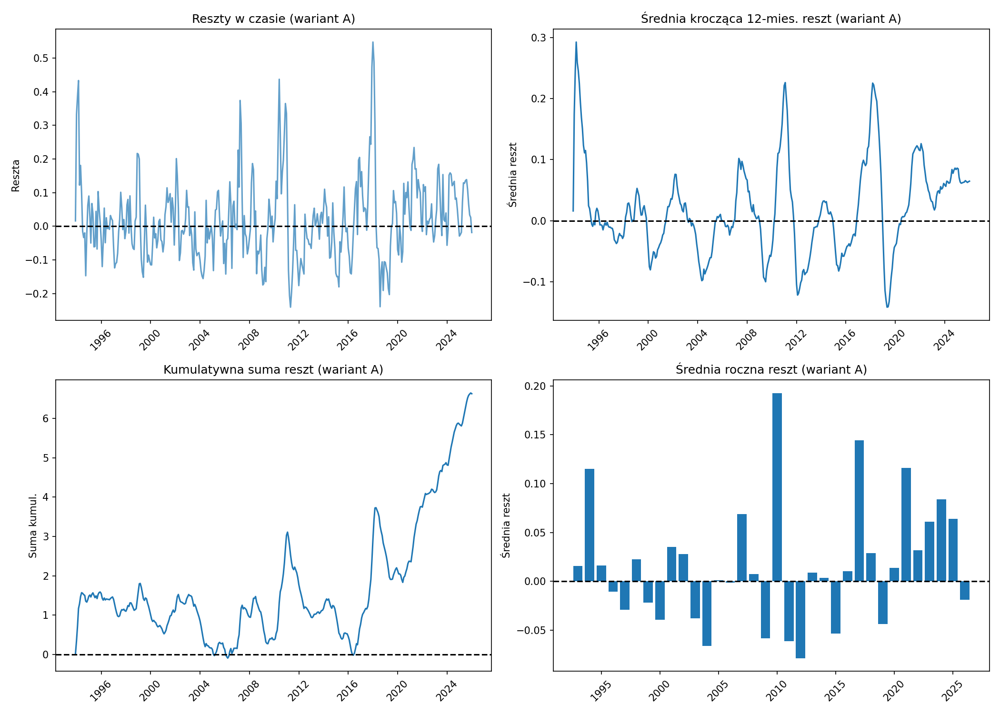

# Analiza reszt modelu klimatycznego – Jezioro Suszewskie

Dla prostego modelu klimatycznego ΔH = f(opad, temperatura, H_lag1, sezonowość) wykonano analizę reszt: wariant A (cały rok) oraz osobno sezon zimowy (XI–III) i letni (IV–X).

- **R² test (cały rok):** 0.2235. **Trend w resztach:** istotny (p = 0.0195).

- **Sezon zimowy** R² test: -0.5735; **sezon letni** R² test: 0.1693.

## Reszty – wariant A (cały rok)

## Reszty – sezon zimowy (XI–III)

## Reszty – sezon letni (IV–X)

---

[Raport podsumowujący](raport_podsumowujacy.md) | [Podsumowanie ewaluacji](podsumowanie_ewaluacji.md)

*Wygenerowano: 2026-02-15 20:31*
