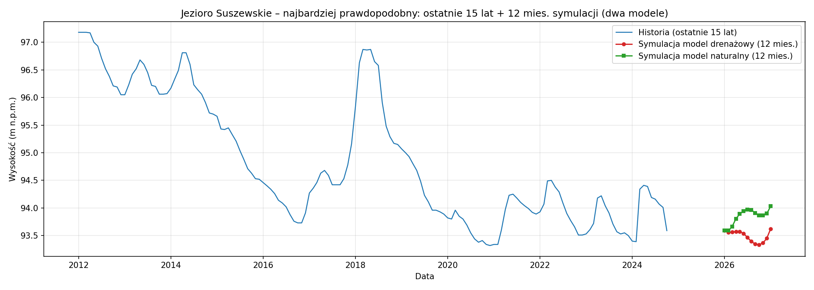
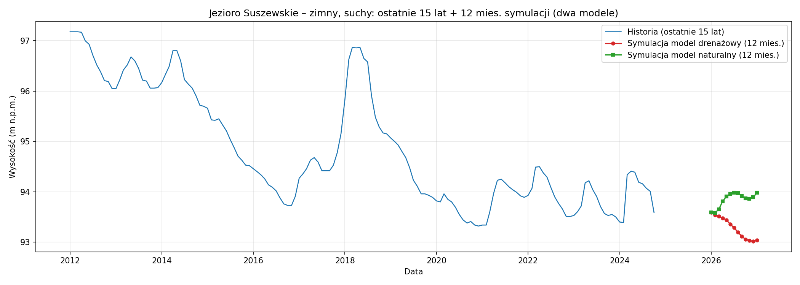
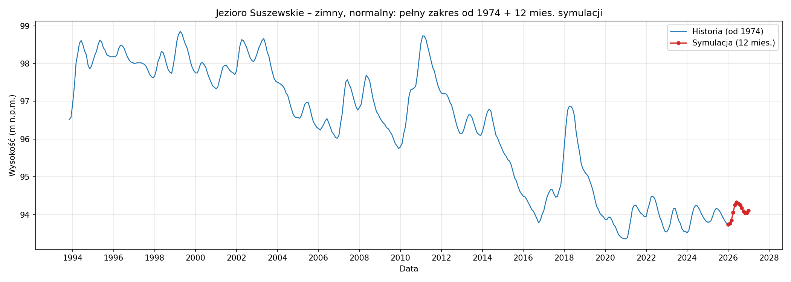
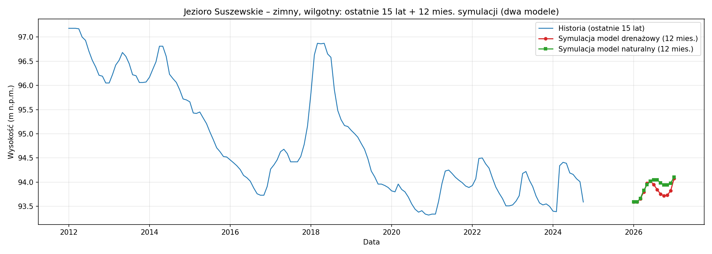
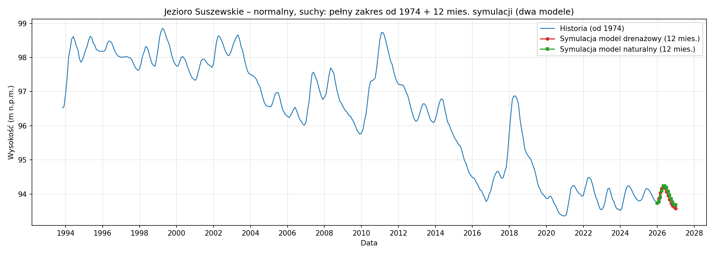
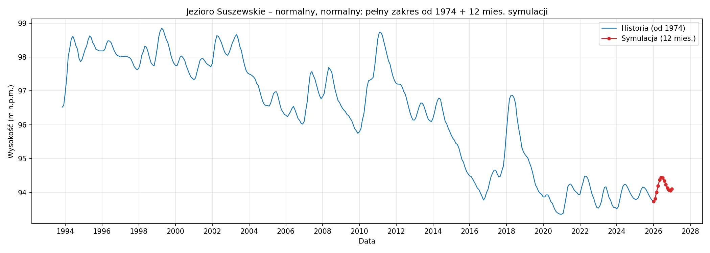
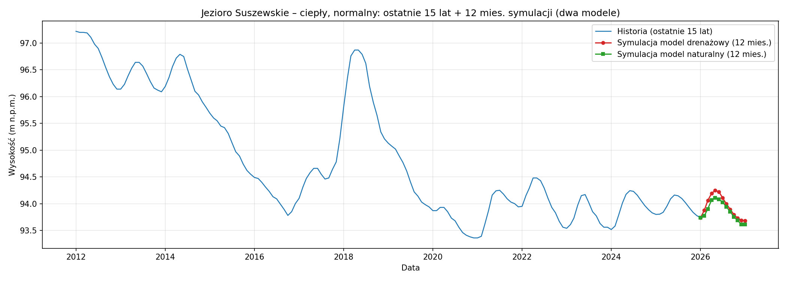
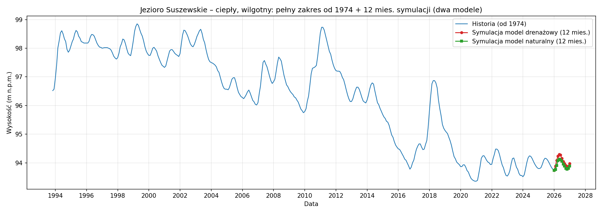

# Raport: Jezioro Suszewskie

Raport ewaluacji na następne 12 miesięcy dla Jezioro Suszewskie.

## Poziom wody: rzeczywisty pomiar i model

Niebieska linia: poziom z pliku `data/suszewskie/data.csv` (pomiar na pierwszy dzień miesiąca). Przerywana pomarańczowa: wahania poziomu według modelu (scenariusz kumulatywny z prognozy zmiany miesięcznej).

## Symulacje wariantów pogodowych (12 miesięcy do przodu)

Dla każdego wariantu (temperatura: zimny/normalny/ciepły × opad: suchy/normalny/wilgotny) opad i temperatura z percentyli historycznych w `data/suszewskie/data.csv`. Symulacja: 12 miesięcy do końca stycznia 2027 (stan na koniec stycznia 2026 to pomiar rzeczywisty). Wykres: pełny zakres historii (od 1974) + 12 miesięcy symulacji.

**Szansa realizacji** (na podstawie zgodności z ostatnimi 12 miesiącami pomiarowymi – średni opad i temperatura):

| Wariant | Szansa realizacji (%) |
|---------|------------------------|
| zimny, suchy | 11.5 |
| zimny, normalny | 14.1 |
| zimny, wilgotny | 7.1 |
| normalny, suchy | 11.9 |
| normalny, normalny | 15.0 |
| normalny, wilgotny | 7.3 |
| ciepły, suchy | 11.6 |
| ciepły, normalny | 14.3 |
| ciepły, wilgotny | 7.2 |

**Najbardziej prawdopodobny poziom na koniec stycznia 2027** (średnia ważona zmian miesięcznych według szans realizacji wszystkich wariantów): **93.824 m n.p.m.** W stosunku do stanu na koniec stycznia 2026 (93.7383 m n.p.m.): przybędzie +0.086 m (+8.6 cm).

### najbardziej prawdopodobny

| Data | Opad (mm) | Temperatura (°C) | Zmiana prognoza (cm) | Poziom (m n.p.m.) |
|------|-----------|------------------|----------------------|-------------------|
| 2026-02 | 34.3 | 1.3 | +3.3 cm | 93.771 |
| 2026-03 | 34.2 | 4.4 | +13.5 cm | 93.906 |
| 2026-04 | 25.7 | 9.3 | +18.6 cm | 94.092 |
| 2026-05 | 47.7 | 13.8 | +11.7 cm | 94.209 |
| 2026-06 | 50.3 | 17.8 | +0.9 cm | 94.218 |
| 2026-07 | 68.4 | 19.9 | -4.8 cm | 94.169 |
| 2026-08 | 54.3 | 19.2 | -7.5 cm | 94.094 |
| 2026-09 | 38.8 | 14.9 | -9.0 cm | 94.004 |
| 2026-10 | 33.6 | 9.8 | -9.3 cm | 93.911 |
| 2026-11 | 34.2 | 4.7 | -7.1 cm | 93.84 |
| 2026-12 | 35.3 | 1.4 | -3.5 cm | 93.805 |
| 2027-01 | 38.3 | -0.1 | +1.9 cm | 93.824 |

- **Średnia ważona wszystkich wariantów (bez własnej szansy realizacji).**
- **Średnia temperatura roczna (prognoza):** 9.7 °C
- **Suma opadu (prognoza):** 495.2 mm
- **Różnica poziomu wody** (koniec symulacji − start): +0.086 m (+8.6 cm)
- **Poziom na koniec stycznia 2027:** 93.824 m n.p.m.

### zimny, suchy

| Data | Opad (mm) | Temperatura (°C) | Zmiana prognoza (cm) | Poziom (m n.p.m.) |
|------|-----------|------------------|----------------------|-------------------|
| 2026-02 | 25.8 | -1.1 | +2.6 cm | 93.764 |
| 2026-03 | 22.6 | 3.2 | +7.2 cm | 93.836 |
| 2026-04 | 15.6 | 8.3 | +16.8 cm | 94.004 |
| 2026-05 | 34.9 | 12.8 | +12.1 cm | 94.125 |
| 2026-06 | 33.1 | 16.5 | +1.3 cm | 94.138 |
| 2026-07 | 53.0 | 19.3 | -4.9 cm | 94.089 |
| 2026-08 | 35.1 | 18.4 | -9.2 cm | 93.997 |
| 2026-09 | 22.6 | 13.7 | -11.6 cm | 93.881 |
| 2026-10 | 20.1 | 8.4 | -10.8 cm | 93.773 |
| 2026-11 | 21.2 | 3.5 | -8.1 cm | 93.692 |
| 2026-12 | 25.4 | -0.2 | -5.3 cm | 93.639 |
| 2027-01 | 28.2 | -2.0 | -1.4 cm | 93.626 |

- **Szansa realizacji:** 11.5 %
- **Średnia temperatura roczna (prognoza):** 8.4 °C
- **Suma opadu (prognoza):** 337.6 mm
- **Różnica poziomu wody** (koniec symulacji − start): -0.112 m (-11.2 cm)
- **Poziom na koniec stycznia 2027:** 93.626 m n.p.m.

### zimny, normalny

| Data | Opad (mm) | Temperatura (°C) | Zmiana prognoza (cm) | Poziom (m n.p.m.) |
|------|-----------|------------------|----------------------|-------------------|
| 2026-02 | 34.8 | -1.1 | +2.6 cm | 93.764 |
| 2026-03 | 35.8 | 3.2 | +8.8 cm | 93.852 |
| 2026-04 | 28.6 | 8.3 | +20.3 cm | 94.055 |
| 2026-05 | 47.6 | 12.8 | +19.8 cm | 94.253 |
| 2026-06 | 54.0 | 16.5 | +7.2 cm | 94.325 |
| 2026-07 | 66.1 | 19.3 | -2.6 cm | 94.298 |
| 2026-08 | 57.5 | 18.4 | -4.7 cm | 94.252 |
| 2026-09 | 42.1 | 13.7 | -7.9 cm | 94.173 |
| 2026-10 | 35.9 | 8.4 | -8.5 cm | 94.088 |
| 2026-11 | 38.4 | 3.5 | -4.1 cm | 94.046 |
| 2026-12 | 37.6 | -0.2 | -0.0 cm | 94.046 |
| 2027-01 | 39.5 | -2.0 | +5.8 cm | 94.104 |

- **Szansa realizacji:** 14.1 %
- **Średnia temperatura roczna (prognoza):** 8.4 °C
- **Suma opadu (prognoza):** 517.9 mm
- **Różnica poziomu wody** (koniec symulacji − start): +0.366 m (+36.6 cm)
- **Poziom na koniec stycznia 2027:** 94.104 m n.p.m.

### zimny, wilgotny

| Data | Opad (mm) | Temperatura (°C) | Zmiana prognoza (cm) | Poziom (m n.p.m.) |
|------|-----------|------------------|----------------------|-------------------|
| 2026-02 | 47.2 | -1.1 | +4.0 cm | 93.778 |
| 2026-03 | 49.9 | 3.2 | +17.8 cm | 93.956 |
| 2026-04 | 36.2 | 8.3 | +23.4 cm | 94.19 |
| 2026-05 | 68.5 | 12.8 | +21.5 cm | 94.405 |
| 2026-06 | 71.0 | 16.5 | +10.9 cm | 94.514 |
| 2026-07 | 97.8 | 19.3 | -1.7 cm | 94.497 |
| 2026-08 | 78.9 | 18.4 | -4.5 cm | 94.452 |
| 2026-09 | 58.4 | 13.7 | -5.5 cm | 94.398 |
| 2026-10 | 51.1 | 8.4 | -5.4 cm | 94.344 |
| 2026-11 | 46.8 | 3.5 | -2.1 cm | 94.323 |
| 2026-12 | 46.7 | -0.2 | +11.5 cm | 94.438 |
| 2027-01 | 52.4 | -2.0 | +20.7 cm | 94.645 |

- **Szansa realizacji:** 7.1 %
- **Średnia temperatura roczna (prognoza):** 8.4 °C
- **Suma opadu (prognoza):** 704.9 mm
- **Różnica poziomu wody** (koniec symulacji − start): +0.907 m (+90.7 cm)
- **Poziom na koniec stycznia 2027:** 94.645 m n.p.m.

### normalny, suchy

| Data | Opad (mm) | Temperatura (°C) | Zmiana prognoza (cm) | Poziom (m n.p.m.) |
|------|-----------|------------------|----------------------|-------------------|
| 2026-02 | 25.8 | 1.0 | +3.1 cm | 93.769 |
| 2026-03 | 22.6 | 4.3 | +14.2 cm | 93.911 |
| 2026-04 | 15.6 | 9.1 | +18.4 cm | 94.095 |
| 2026-05 | 34.9 | 13.6 | +10.3 cm | 94.198 |
| 2026-06 | 33.1 | 17.9 | -0.3 cm | 94.195 |
| 2026-07 | 53.0 | 19.8 | -5.8 cm | 94.137 |
| 2026-08 | 35.1 | 19.3 | -10.6 cm | 94.032 |
| 2026-09 | 22.6 | 14.8 | -11.7 cm | 93.915 |
| 2026-10 | 20.1 | 9.8 | -11.5 cm | 93.8 |
| 2026-11 | 21.2 | 4.9 | -10.1 cm | 93.698 |
| 2026-12 | 25.4 | 1.8 | -8.1 cm | 93.618 |
| 2027-01 | 28.2 | -0.1 | -4.9 cm | 93.569 |

- **Szansa realizacji:** 11.9 %
- **Średnia temperatura roczna (prognoza):** 9.7 °C
- **Suma opadu (prognoza):** 337.6 mm
- **Różnica poziomu wody** (koniec symulacji − start): -0.169 m (-16.9 cm)
- **Poziom na koniec stycznia 2027:** 93.569 m n.p.m.

### normalny, normalny

| Data | Opad (mm) | Temperatura (°C) | Zmiana prognoza (cm) | Poziom (m n.p.m.) |
|------|-----------|------------------|----------------------|-------------------|
| 2026-02 | 34.8 | 1.0 | +3.1 cm | 93.769 |
| 2026-03 | 35.8 | 4.3 | +15.0 cm | 93.92 |
| 2026-04 | 28.6 | 9.1 | +20.2 cm | 94.121 |
| 2026-05 | 47.6 | 13.6 | +14.2 cm | 94.263 |
| 2026-06 | 54.0 | 17.9 | -0.9 cm | 94.254 |
| 2026-07 | 66.1 | 19.8 | -4.9 cm | 94.206 |
| 2026-08 | 57.5 | 19.3 | -6.6 cm | 94.14 |
| 2026-09 | 42.1 | 14.8 | -9.0 cm | 94.05 |
| 2026-10 | 35.9 | 9.8 | -9.2 cm | 93.958 |
| 2026-11 | 38.4 | 4.9 | -7.7 cm | 93.881 |
| 2026-12 | 37.6 | 1.8 | -6.4 cm | 93.817 |
| 2027-01 | 39.5 | -0.1 | -0.2 cm | 93.815 |

- **Szansa realizacji:** 15.0 %
- **Średnia temperatura roczna (prognoza):** 9.7 °C
- **Suma opadu (prognoza):** 517.9 mm
- **Różnica poziomu wody** (koniec symulacji − start): +0.077 m (+7.7 cm)
- **Poziom na koniec stycznia 2027:** 93.815 m n.p.m.

### normalny, wilgotny

| Data | Opad (mm) | Temperatura (°C) | Zmiana prognoza (cm) | Poziom (m n.p.m.) |
|------|-----------|------------------|----------------------|-------------------|
| 2026-02 | 47.2 | 1.0 | +4.6 cm | 93.784 |
| 2026-03 | 49.9 | 4.3 | +19.6 cm | 93.98 |
| 2026-04 | 36.2 | 9.1 | +22.3 cm | 94.203 |
| 2026-05 | 68.5 | 13.6 | +15.9 cm | 94.362 |
| 2026-06 | 71.0 | 17.9 | +0.3 cm | 94.364 |
| 2026-07 | 97.8 | 19.8 | -4.5 cm | 94.32 |
| 2026-08 | 78.9 | 19.3 | -5.7 cm | 94.263 |
| 2026-09 | 58.4 | 14.8 | -7.0 cm | 94.193 |
| 2026-10 | 51.1 | 9.8 | -7.0 cm | 94.123 |
| 2026-11 | 46.8 | 4.9 | -5.5 cm | 94.068 |
| 2026-12 | 46.7 | 1.8 | +0.4 cm | 94.072 |
| 2027-01 | 52.4 | -0.1 | +7.2 cm | 94.144 |

- **Szansa realizacji:** 7.3 %
- **Średnia temperatura roczna (prognoza):** 9.7 °C
- **Suma opadu (prognoza):** 704.9 mm
- **Różnica poziomu wody** (koniec symulacji − start): +0.406 m (+40.6 cm)
- **Poziom na koniec stycznia 2027:** 94.144 m n.p.m.

### ciepły, suchy

| Data | Opad (mm) | Temperatura (°C) | Zmiana prognoza (cm) | Poziom (m n.p.m.) |
|------|-----------|------------------|----------------------|-------------------|
| 2026-02 | 25.8 | 3.8 | +3.3 cm | 93.771 |
| 2026-03 | 22.6 | 5.5 | +13.0 cm | 93.901 |
| 2026-04 | 15.6 | 10.5 | +14.5 cm | 94.046 |
| 2026-05 | 34.9 | 15.0 | +2.1 cm | 94.066 |
| 2026-06 | 33.1 | 18.9 | -3.7 cm | 94.03 |
| 2026-07 | 53.0 | 20.4 | -7.4 cm | 93.956 |
| 2026-08 | 35.1 | 20.0 | -11.4 cm | 93.842 |
| 2026-09 | 22.6 | 16.1 | -11.0 cm | 93.732 |
| 2026-10 | 20.1 | 11.2 | -11.7 cm | 93.615 |
| 2026-11 | 21.2 | 5.7 | -10.3 cm | 93.512 |
| 2026-12 | 25.4 | 2.6 | -8.2 cm | 93.43 |
| 2027-01 | 28.2 | 1.9 | -4.8 cm | 93.382 |

- **Szansa realizacji:** 11.6 %
- **Średnia temperatura roczna (prognoza):** 11.0 °C
- **Suma opadu (prognoza):** 337.6 mm
- **Różnica poziomu wody** (koniec symulacji − start): -0.356 m (-35.6 cm)
- **Poziom na koniec stycznia 2027:** 93.382 m n.p.m.

### ciepły, normalny

| Data | Opad (mm) | Temperatura (°C) | Zmiana prognoza (cm) | Poziom (m n.p.m.) |
|------|-----------|------------------|----------------------|-------------------|
| 2026-02 | 34.8 | 3.8 | +3.3 cm | 93.771 |
| 2026-03 | 35.8 | 5.5 | +13.8 cm | 93.908 |
| 2026-04 | 28.6 | 10.5 | +16.3 cm | 94.071 |
| 2026-05 | 47.6 | 15.0 | +4.0 cm | 94.111 |
| 2026-06 | 54.0 | 18.9 | -2.8 cm | 94.083 |
| 2026-07 | 66.1 | 20.4 | -5.5 cm | 94.028 |
| 2026-08 | 57.5 | 20.0 | -6.9 cm | 93.959 |
| 2026-09 | 42.1 | 16.1 | -8.1 cm | 93.877 |
| 2026-10 | 35.9 | 11.2 | -9.2 cm | 93.786 |
| 2026-11 | 38.4 | 5.7 | -7.4 cm | 93.711 |
| 2026-12 | 37.6 | 2.6 | -6.5 cm | 93.646 |
| 2027-01 | 39.5 | 1.9 | -0.5 cm | 93.641 |

- **Szansa realizacji:** 14.3 %
- **Średnia temperatura roczna (prognoza):** 11.0 °C
- **Suma opadu (prognoza):** 517.9 mm
- **Różnica poziomu wody** (koniec symulacji − start): -0.097 m (-9.7 cm)
- **Poziom na koniec stycznia 2027:** 93.641 m n.p.m.

### ciepły, wilgotny

| Data | Opad (mm) | Temperatura (°C) | Zmiana prognoza (cm) | Poziom (m n.p.m.) |
|------|-----------|------------------|----------------------|-------------------|
| 2026-02 | 47.2 | 3.8 | +4.4 cm | 93.782 |
| 2026-03 | 49.9 | 5.5 | +18.4 cm | 93.966 |
| 2026-04 | 36.2 | 10.5 | +18.6 cm | 94.152 |
| 2026-05 | 68.5 | 15.0 | +8.9 cm | 94.241 |
| 2026-06 | 71.0 | 18.9 | -1.3 cm | 94.228 |
| 2026-07 | 97.8 | 20.4 | -5.4 cm | 94.174 |
| 2026-08 | 78.9 | 20.0 | -7.7 cm | 94.097 |
| 2026-09 | 58.4 | 16.1 | -6.7 cm | 94.029 |
| 2026-10 | 51.1 | 11.2 | -7.5 cm | 93.955 |
| 2026-11 | 46.8 | 5.7 | -5.3 cm | 93.902 |
| 2026-12 | 46.7 | 2.6 | +0.5 cm | 93.907 |
| 2027-01 | 52.4 | 1.9 | +7.1 cm | 93.978 |

- **Szansa realizacji:** 7.2 %
- **Średnia temperatura roczna (prognoza):** 11.0 °C
- **Suma opadu (prognoza):** 704.9 mm
- **Różnica poziomu wody** (koniec symulacji − start): +0.240 m (+24.0 cm)
- **Poziom na koniec stycznia 2027:** 93.978 m n.p.m.

*Wygenerowano: 2026-02-15 12:16*