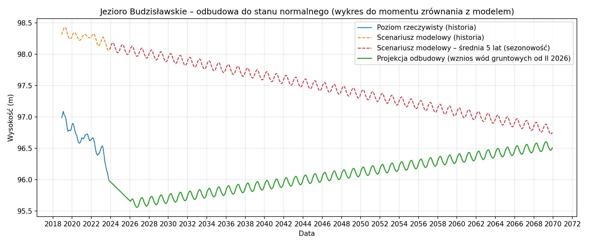
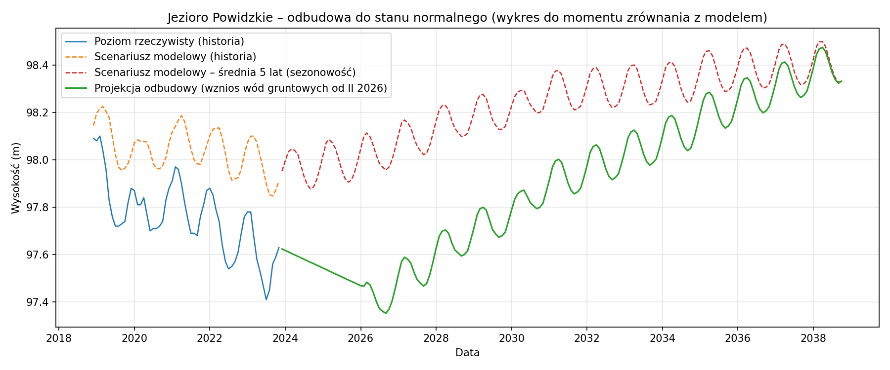

# Szacunek lat odbudowy poziomu po zaniku dodatkowego źródła drenażu

## Założenia (uproszczone)

- **Rozbieżność** = wysokość rzeczywista − wysokość w scenariuszu modelowym (klimat, sezon, lagi). Ujemna = jezioro poniżej scenariusza.
- Przy **zaniku dodatkowego drenażu** zakładamy, że poziom rzeczywisty dąży do scenariusza modelowego; szacujemy **ile lat** potrzeba na „zamknięcie” obecnej luki.
- **Scenariusz A (symmetric):** odbudowa z prędkością równą obserwowanemu tempu narastania rozjazdu (trend liniowy rozbieżności w czasie).
- **Scenariusz B (stałe tempo):** odbudowa z prędkością **5.0 cm/rok**.
- Wartości oparte na średniej rozbieżności z **ostatnich 12 miesięcy** i trendzie z pełnego szeregu ewaluacji. **Szacunek teoretyczny**, bez modelowania hydrologicznego odbudowy.
- **Projekcja odbudowy:** scenariusz modelowy przy **średnich warunkach z ostatnich 5 lat (sezonowość)**. Do 2/2026 poziom rzeczywisty – **trend z ostatnich 5 lat** rzeczywistych pomiarów; od 2/2026 **wznios wód gruntowych** (cm/rok z CSV lub 5 cm/rok). Wykres do momentu zrównania z modelem (koniec odbudowy).

---

## Wznios poziomu wód gruntowych – porównanie

Dwa wzniosy dla porównania (źródło: `data/zanik_drenazu.csv`): wznios bazowy oraz wznios po zalaniu kopalni.

| Jezioro | Wznios (cm/rok) | Wznios po zalaniu kopalni (cm/rok) |
|---------|-----------------|-------------------------------------|
| Jezioro Budzisławskie | — | — |
| Jezioro Koziegłowskie | — | — |
| Jezioro Niedzięgiel | — | — |
| Jezioro Ostrowskie | — | — |
| Jezioro Powidzkie | — | — |
| Jezioro Skulska Wieś | — | — |
| Jezioro Suszewskie | — | — |
| Jezioro Wilczyńskie | — | — |

---

## Wyniki per jezioro

### Jezioro Budzisławskie

- **Średnia rozbieżność (ostatnie 12 miesięcy):** -1.865 m
- **Trend rozbieżności:** -6.60 cm/rok
- **Szacunek odbudowy (scenariusz A, symmetric):** 28.2 lat
- **Szacunek odbudowy (scenariusz B, 5.0 cm/rok):** 37.3 lat

### Jezioro Koziegłowskie

- **Średnia rozbieżność (ostatnie 12 miesięcy):** -0.940 m
- **Trend rozbieżności:** -4.41 cm/rok
- **Szacunek odbudowy (scenariusz A, symmetric):** 21.3 lat
- **Szacunek odbudowy (scenariusz B, 5.0 cm/rok):** 18.8 lat

### Jezioro Niedzięgiel

- **Średnia rozbieżność (ostatnie 12 miesięcy):** -0.729 m
- **Trend rozbieżności:** -0.84 cm/rok
- **Szacunek odbudowy (scenariusz A, symmetric):** 86.7 lat
- **Szacunek odbudowy (scenariusz B, 5.0 cm/rok):** 14.6 lat

### Jezioro Ostrowskie

- **Średnia rozbieżność (ostatnie 12 miesięcy):** -3.334 m
- **Trend rozbieżności:** -10.66 cm/rok
- **Szacunek odbudowy (scenariusz A, symmetric):** 31.3 lat
- **Szacunek odbudowy (scenariusz B, 5.0 cm/rok):** 66.7 lat

### Jezioro Powidzkie

- **Średnia rozbieżność (ostatnie 12 miesięcy):** -0.376 m
- **Trend rozbieżności:** -0.67 cm/rok
- **Szacunek odbudowy (scenariusz A, symmetric):** 56.2 lat
- **Szacunek odbudowy (scenariusz B, 5.0 cm/rok):** 7.5 lat

### Jezioro Skulska Wieś

- **Średnia rozbieżność (ostatnie 12 miesięcy):** 0.094 m
- **Trend rozbieżności:** 0.71 cm/rok
- **Szacunek odbudowy (scenariusz A):** —
- **Szacunek odbudowy (scenariusz B):** —

### Jezioro Suszewskie

- **Średnia rozbieżność (ostatnie 12 miesięcy):** -4.394 m
- **Trend rozbieżności:** -15.64 cm/rok
- **Szacunek odbudowy (scenariusz A, symmetric):** 28.1 lat
- **Szacunek odbudowy (scenariusz B, 5.0 cm/rok):** 87.9 lat

### Jezioro Wilczyńskie

- **Średnia rozbieżność (ostatnie 12 miesięcy):** -5.170 m
- **Trend rozbieżności:** -19.29 cm/rok
- **Szacunek odbudowy (scenariusz A, symmetric):** 26.8 lat
- **Szacunek odbudowy (scenariusz B, 5.0 cm/rok):** 103.4 lat

---

## Wykresy projekcji odbudowy

Średnia 5 lat z sezonowymi wahaniami (opad i temperatura per miesiąc); projekcja do 2070 lub do zrównania z modelem.

### Jezioro Budzisławskie

### Jezioro Koziegłowskie

### Jezioro Niedzięgiel

### Jezioro Ostrowskie

### Jezioro Powidzkie

### Jezioro Skulska Wieś

### Jezioro Suszewskie

### Jezioro Wilczyńskie

---

## Uwagi

- Analiza **całkowicie osobna** od wnioskowania o istnieniu czynnika drenującego; służy tylko do zgrubnego szacunku czasu odbudowy.
- Rzeczywista odbudowa zależy od zatrzymania drenażu, warunków klimatycznych i bilansu wód podziemnych; powyższe wartości mają charakter orientacyjny.