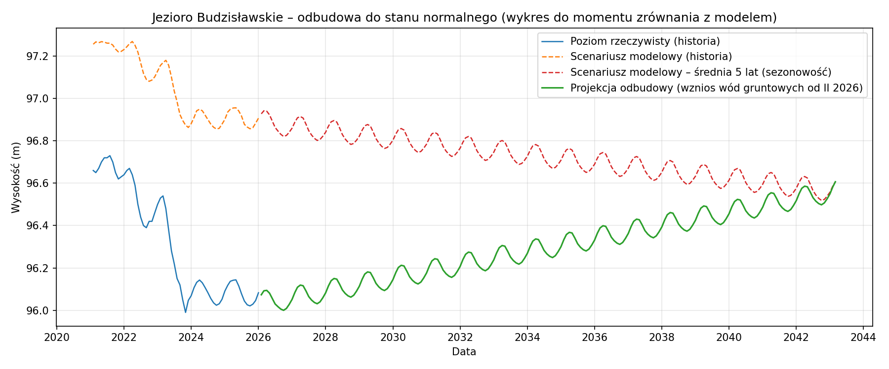
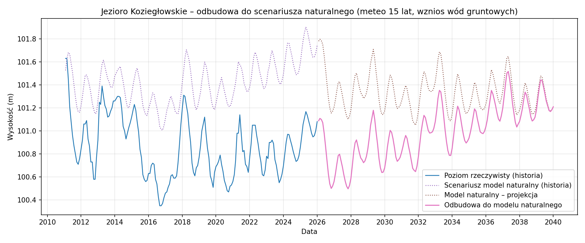
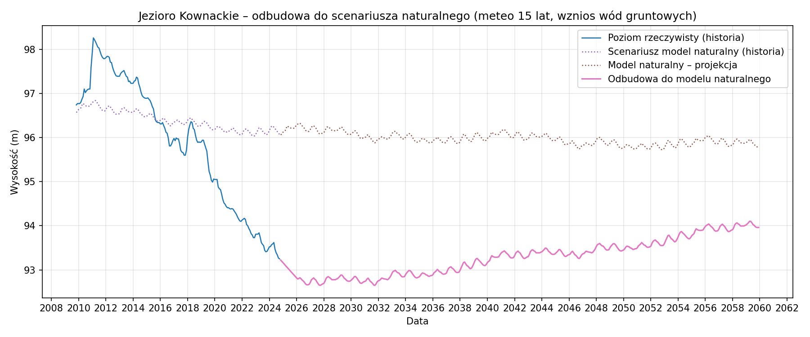
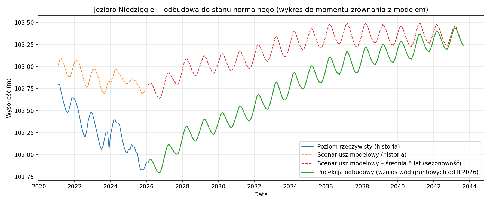
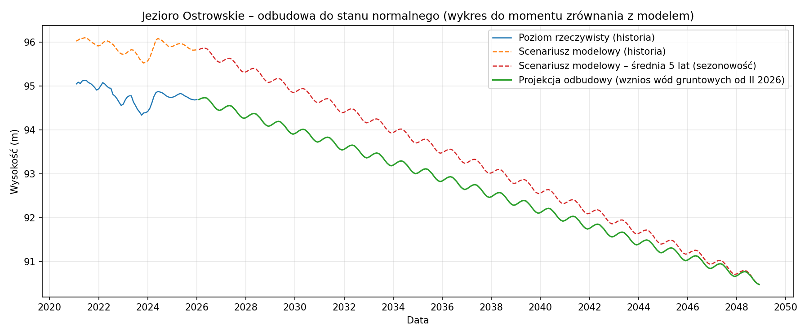
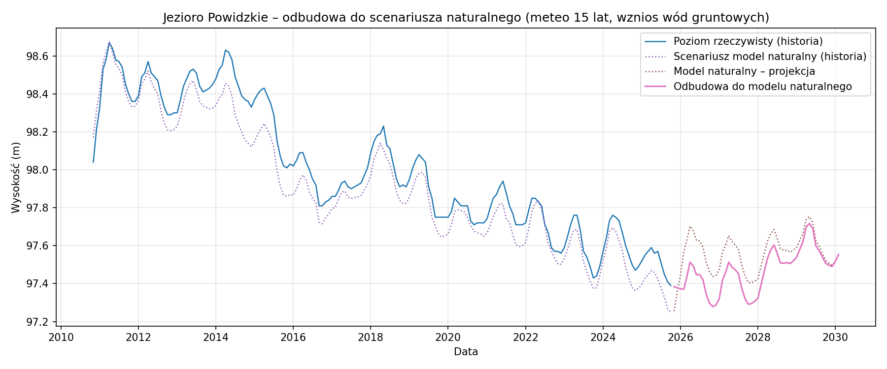
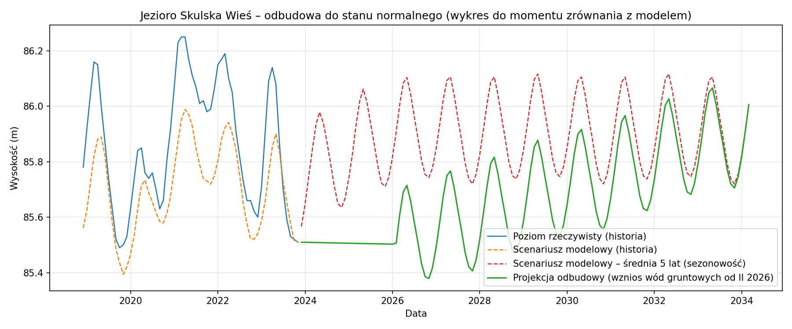
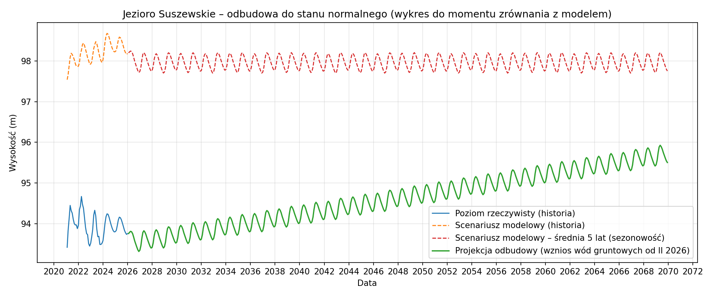

# Szacunek lat odbudowy poziomu po zaniku dodatkowego źródła drenażu

## Założenia (uproszczone)

- **Rozbieżność** = wysokość rzeczywista − wysokość w scenariuszu modelowym (klimat, sezon, lagi). Ujemna = jezioro poniżej scenariusza.
- Przy **zaniku dodatkowego drenażu** zakładamy, że poziom rzeczywisty dąży do scenariusza modelowego; szacujemy **ile lat** potrzeba na „zamknięcie” obecnej luki.
- **Scenariusz A (symmetric):** odbudowa z prędkością równą obserwowanemu tempu narastania rozjazdu (trend liniowy rozbieżności w czasie).
- **Scenariusz B (stałe tempo):** odbudowa z prędkością **5.0 cm/rok**.
- Wartości oparte na średniej rozbieżności z **ostatnich 12 miesięcy** i trendzie z pełnego szeregu ewaluacji. **Szacunek teoretyczny**, bez modelowania hydrologicznego odbudowy.
- **Projekcja odbudowy:** scenariusz modelowy przy **meteo z ostatnich 15 lat** (sekwencja miesięczna, bez harmonijki). Do 2/2026 poziom rzeczywisty – **trend z ostatnich 5 lat**; od 2/2026 **wznios wód gruntowych** (cm/rok z CSV lub 5 cm/rok). Wykres: tylko odbudowa do scenariusza naturalnego (bez scenariusza drenażowego).

---

## Wznios poziomu wód gruntowych – porównanie

Dwa wzniosy dla porównania (źródło: `data/zanik_drenazu.csv`): wznios bazowy oraz wznios po zalaniu kopalni.

| Jezioro | Wznios (cm/rok) | Wznios po zalaniu kopalni (cm/rok) |
|---------|-----------------|-------------------------------------|
| Jezioro Budzisławskie | — | — |
| Jezioro Koziegłowskie | — | — |
| Jezioro Kownackie | — | — |
| Jezioro Niedzięgiel | — | — |
| Jezioro Ostrowskie | — | — |
| Jezioro Powidzkie | — | — |
| Jezioro Skulska Wieś | — | — |
| Jezioro Suszewskie | — | — |
| Jezioro Wilczyńskie | — | — |

---

## Wyniki per jezioro

### Jezioro Budzisławskie

- **Średnia rozbieżność (ostatnie 12 miesięcy):** 109.0 cm
- **Trend rozbieżności:** 2.53 cm/rok
- **Szacunek odbudowy (scenariusz A):** —
- **Szacunek odbudowy (scenariusz B):** —

### Jezioro Koziegłowskie

- **Średnia rozbieżność (ostatnie 12 miesięcy):** 75.0 cm
- **Trend rozbieżności:** 2.98 cm/rok
- **Szacunek odbudowy (scenariusz A):** —
- **Szacunek odbudowy (scenariusz B):** —

### Jezioro Kownackie

- **Średnia rozbieżność (ostatnie 12 miesięcy):** 241.0 cm
- **Trend rozbieżności:** 5.97 cm/rok
- **Szacunek odbudowy (scenariusz A):** —
- **Szacunek odbudowy (scenariusz B):** —

### Jezioro Niedzięgiel

- **Średnia rozbieżność (ostatnie 12 miesięcy):** 846.3 cm
- **Trend rozbieżności:** 18.32 cm/rok
- **Szacunek odbudowy (scenariusz A):** —
- **Szacunek odbudowy (scenariusz B):** —

### Jezioro Ostrowskie

- **Średnia rozbieżność (ostatnie 12 miesięcy):** 184.4 cm
- **Trend rozbieżności:** 5.17 cm/rok
- **Szacunek odbudowy (scenariusz A):** —
- **Szacunek odbudowy (scenariusz B):** —

### Jezioro Powidzkie

- **Średnia rozbieżność (ostatnie 12 miesięcy):** 395.9 cm
- **Trend rozbieżności:** 8.23 cm/rok
- **Szacunek odbudowy (scenariusz A):** —
- **Szacunek odbudowy (scenariusz B):** —

### Jezioro Skulska Wieś

- **Średnia rozbieżność (ostatnie 12 miesięcy):** 51.6 cm
- **Trend rozbieżności:** 1.66 cm/rok
- **Szacunek odbudowy (scenariusz A):** —
- **Szacunek odbudowy (scenariusz B):** —

### Jezioro Suszewskie

- **Średnia rozbieżność (ostatnie 12 miesięcy):** 407.1 cm
- **Trend rozbieżności:** 12.39 cm/rok
- **Szacunek odbudowy (scenariusz A):** —
- **Szacunek odbudowy (scenariusz B):** —

### Jezioro Wilczyńskie

- **Średnia rozbieżność (ostatnie 12 miesięcy):** 362.9 cm
- **Trend rozbieżności:** 8.39 cm/rok
- **Szacunek odbudowy (scenariusz A):** —
- **Szacunek odbudowy (scenariusz B):** —

---

## Wykresy projekcji odbudowy

Dla każdego jeziora: **odbudowa do scenariusza naturalnego** (meteo z ostatnich 15 lat, wznios wód gruntowych). Wykres bez scenariusza drenażowego – kontekst to odbudowa po zaniku drenażu.

### Jezioro Budzisławskie

### Jezioro Koziegłowskie

### Jezioro Kownackie

### Jezioro Niedzięgiel

### Jezioro Ostrowskie

### Jezioro Powidzkie

### Jezioro Skulska Wieś

### Jezioro Suszewskie

### Jezioro Wilczyńskie

---

## Uwagi

- Analiza **całkowicie osobna** od wnioskowania o istnieniu czynnika drenującego; służy tylko do zgrubnego szacunku czasu odbudowy.
- Rzeczywista odbudowa zależy od zatrzymania drenażu, warunków klimatycznych i bilansu wód podziemnych; powyższe wartości mają charakter orientacyjny.